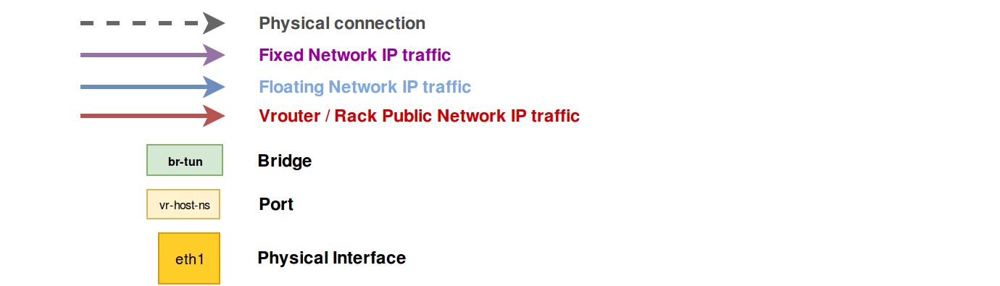

# fuel-plugin-external-lb

## Purpsoe
The main purpose of this plugin is to provide ability to use external load balancer instead of Haproxy which is deployed on controllers.

It can also allow cloud operators to move controllers into different racks (see more details below).

## Requirements
External load balancer configuration is out of scope of this plugin. We assume that you configure load balancer by other means (manually or by some other Fuel plugin).

In order to configure your load balancer properly before deployment starts, you can use deployment info provided by Fuel. So you need to:

1. Create new environment
2. Enable plugin
3. Configure your environment (assign roles, networks, adjust settings, etc)
4. Download deployment info with the following CLI command on Fuel node:
```bash
fuel deployment --env 1 --default
```
After this you can open any yaml in `./deployment_1/` directory and check controller management and public IPs in `network_metadata/nodes` hash.

If you want to Public TLS then please note that Fuel generates self-signed SSL certificate during deployment, so you can't download it before deployment starts and configure it on external load balancer. The best solution is to create your own certificate (self signed or issued) and upload it via Fuel -> Settings -> Security.

## Known limitations
* OSTF is not working
* Floating IPs are not working if controllers are in different racks

## Configuration

## How it works
General workflow
* It disables VIP auto allocation in Nailgun which allows us to move controllers into different racks
* It disables VIP deployment and HAproxy configuration on controllers, if operator choses external LB for both public and management VIPs
* It configures “fake floating network” in order to provide access to external networks for OpenStack instances, if operator enables this feature

### Changes in deployment
#### Default deployment procedure
* Run VIPs on controllers
* Setup HAproxy on each controller to balance frontends across all the controllers
* Use `haproxy_backend_status` puppet resource as “synchronization point” in our manifests when we need to wait for some HA frontend to come up (like keystone API)

#### Deployment with External LB
* ~~Run VIPs on controllers~~
* ~~Setup HAproxy on each controller to balance frontends across all the controllers~~
* Use `haproxy_backend_status` puppet resource as “synchronization point” in our manifests when we need to wait for some HA frontend to come up (like keystone API)

### Changes in haproxy_backend_status puppet resource

#### Default deployment procedure
`haproxy_backend_status` puppet resource connects to HAproxy status URL, gets the list of all frontends/backends, finds the needed one and checks if it’s UP or DOWN (`haproxy` provider). Example for keystone-api:

* Connect to http://$LOAD_BALANCER_IP:10000/;csv   ($LOAD_BALANCER_IP = VIP)
* Get list of frontends and check if 'kestone-1' backend is UP

#### Deployment with External LB
`haproxy_backend_status` puppet resource connects to frontend URL directly and checks response HTTP code (`http` provider). Example for keystone-api:

* Connect to http://$LOAD_BALANCER_IP:5000/v3      ($LOAD_BALANCER_IP = External LB)
* Get HTTP responce code and check if it's UP

## How to move controllers to different racks?
In our deployment we use HA resources that are being deployed on controller nodes. Those are mostly services and VIPs.

There are no problems to provide HA for services when we deploy controllers in different racks - we use unicast, so Corosync cluster works fine and provides failover for services without problems.

Providing HA/failover for IPs is the problem here. In case of static routing it’s simply impossible to move IP from one rack to another - such IP won’t be routable anywhere outside its own rack. This problem affects VIPs (services frontends, endpoints) and Floating IPs.

### IP traffic flow chart

#### Default IP flow



#### New IP flow with "fake floating network"


